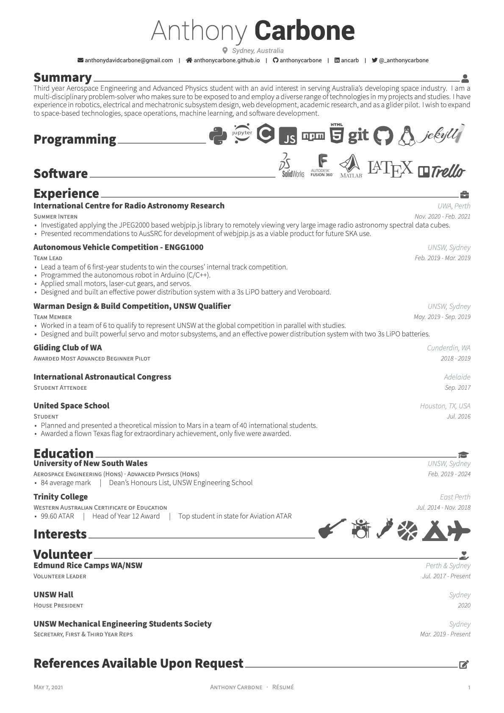

# Anthony Carbone's Resume 📝

This resume uses the beatiful [Awesome CV template](https://github.com/posquit0/Awesome-CV). It also includes some features from [Derwent McElhinney's take on the template](https://github.com/derwentx/Resumee), specifically the icons and icon sections, as well as the references section from an [Awesome CV issue](https://github.com/posquit0/Awesome-CV/issues/94).

I wrote and compiled it [Overleaf](https://www.overleaf.com).

References are available upon request.

Preview:
